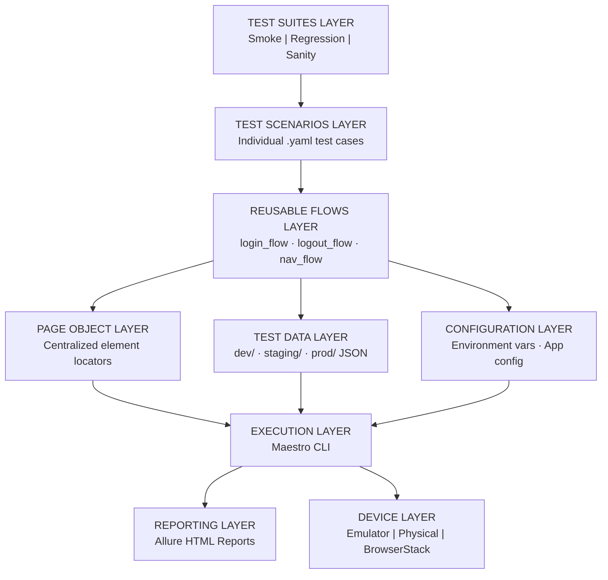
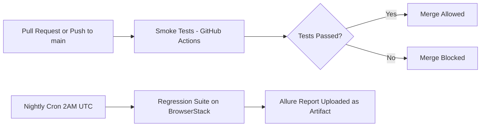

# 📱 Maestro Mobile Automation Framework

**Maestro** · **Android API 29+** · **GitHub Actions CI/CD** · **BrowserStack Cloud** · **Allure Reports** · **MIT License**

> A scalable, layered mobile test automation framework built with Maestro — featuring reusable flows, Page Object locator management, environment-based test data, CI/CD pipelines, Allure reporting, and BrowserStack cloud execution.

---

## Table of Contents

- [Project Overview](#-project-overview)
- [Framework Architecture](#-framework-architecture)
- [Technology Stack](#-technology-stack)
- [Project Folder Structure](#-project-folder-structure)
- [Example Test Flows](#-example-test-flows)
- [Prerequisites](#-prerequisites)
- [Installation Steps](#-installation-steps)
- [Running Tests](#-running-tests)
- [Running Test Suites](#-running-test-suites)
- [CI/CD Integration](#-cicd-integration)
- [Reporting](#-reporting)
- [Cloud Device Testing](#-cloud-device-testing)
- [Parallel Test Execution](#-parallel-test-execution)
- [Best Practices](#-best-practices)
- [Future Improvements](#-future-improvements)
- [Contribution Guidelines](#-contribution-guidelines)

---

## ✨ Project Overview

The **Maestro Mobile Automation Framework** is a production-ready, enterprise-grade mobile UI testing solution designed for scalability, maintainability, and team collaboration. It leverages [Maestro](https://maestro.mobile.dev/) — a fast, YAML-based mobile automation tool — wrapped in a clean layered architecture.

| Stat | Value |
|---|---|
| Test Suites | 3 (Smoke · Regression · Sanity) |
| Reusable Flows | 10+ shared flows |
| Execution Targets | Emulator · Physical · BrowserStack |
| Environments | Dev · Staging · Production |
| CI/CD | GitHub Actions (PR + Nightly) |

**Why this framework?**

```
Traditional mobile testing is slow, brittle, and hard to maintain.
Maestro Mobile Framework solves this with:

  Reusable YAML flows     ->  Write once, run everywhere
  Centralized locators    ->  One change updates all tests
  Environment isolation   ->  Safe runs across dev/staging/prod
  CI/CD native            ->  Automated on every PR and nightly
  Cloud-ready             ->  BrowserStack real device execution
  Rich reporting          ->  Allure dashboards with screenshots
```

---

## 📐 Framework Architecture

The framework is built on a **9-layer architecture** designed to separate concerns, maximise reuse, and scale with your team.



### Layer Responsibilities

| Layer | Files / Location | Responsibility |
|---|---|---|
| **Test Suites** | `tests/smoke/` · `tests/regression/` · `tests/sanity/` | Groups tests by scope and execution purpose |
| **Test Scenarios** | `tests/**/*_test.yaml` | Individual test cases mapped to user stories |
| **Reusable Flows** | `flows/common/` · `flows/checkout/` | Shared YAML flows invoked across multiple tests |
| **Page Objects** | `pages/*.yaml` | Centralised locators — change once, update everywhere |
| **Test Data** | `testdata/dev/` · `testdata/staging/` | Environment-specific JSON test data |
| **Configuration** | `config/environments/` | App settings, env vars, and device configuration |
| **Execution** | Maestro CLI | Runs flows and suites against target devices |
| **Reporting** | `reports/allure-results/` | Allure HTML reports with screenshots and trends |
| **Devices** | Emulator · ADB · BrowserStack | Local and cloud device execution targets |

---

## 🛠️ Technology Stack

| Technology | Role | Version |
|---|---|---|
| [Maestro CLI](https://maestro.mobile.dev/) | Mobile UI Automation Engine | Latest |
| Android SDK | Local device emulation | API 29+ |
| [GitHub Actions](https://github.com/features/actions) | CI/CD pipeline | — |
| [BrowserStack](https://browserstack.com/) | Cloud real device execution | — |
| [Allure Report](https://allurereport.org/) | Test analytics & HTML reports | 2.x |
| YAML | Test flow definition language | — |
| JSON | Test data management | — |
| Bash / Shell | Automation utility scripts | — |

---


---
## Software architecture diagram for a Mobile QA Automation Framework built using Maestro


---
## 📁 Project Folder Structure

```
maestro-mobile-framework
│
├── config
│   ├── dev.yaml
│   ├── staging.yaml
│   └── prod.yaml
│
├── pages
│   ├── login_page.yaml
│   ├── dashboard_page.yaml
│   └── transfer_page.yaml
│
├── flows
│   ├── common
│   │   ├── launch_app.yaml
│   │   ├── login.yaml
│   │   └── logout.yaml
│   │
│   └── business
│       └── transfer_money.yaml
│
├── tests
│   ├── smoke
│   │   └── login_test.yaml
│   │
│   ├── regression
│   │   └── transfer_test.yaml
│   │
│   └── sanity
│
├── testdata
│   ├── users.yaml
│   └── accounts.yaml
│
├── scripts
│   ├── run_smoke.sh
│   └── run_regression.sh
│
├── reports
│
└── README.md
---

## 🧪 Example Test Flows

Real examples of how tests, flows, and page objects are written in this framework — from locator definition all the way to test execution.

---

### 1. Page Object — `pages/login_page.yaml`

Centralised locator definitions reused across all login-related flows and tests. Update once here; it applies everywhere.

```yaml
# pages/login_page.yaml
# ─────────────────────────────────────────────
# Page Object: Login Screen
# Centralizes all element locators for the
# login screen to avoid duplication.
# ─────────────────────────────────────────────

outputVariable: loginPage

env:
  EMAIL_FIELD:      "id:com.app:id/emailInput"
  PASSWORD_FIELD:   "id:com.app:id/passwordInput"
  LOGIN_BUTTON:     "id:com.app:id/loginButton"
  ERROR_MESSAGE:    "id:com.app:id/errorText"
  FORGOT_PASSWORD:  "text:Forgot Password?"
```

---

### 2. Reusable Flow — `flows/common/login_flow.yaml`

A shared login flow callable from any test scenario. Accepts credentials as injected environment variables.

```yaml
# flows/common/login_flow.yaml
# ─────────────────────────────────────────────
# Reusable Flow: Login
# Accepts email and password as parameters.
# Called by any test scenario that requires auth.
# ─────────────────────────────────────────────

appId: ${APP_ID}

---

# Step 1 - Clear and enter email address
- tapOn: ${EMAIL_FIELD}
- clearText
- inputText: ${USER_EMAIL}

# Step 2 - Clear and enter password
- tapOn: ${PASSWORD_FIELD}
- clearText
- inputText: ${USER_PASSWORD}

# Step 3 - Submit the login form
- tapOn: ${LOGIN_BUTTON}

# Step 4 - Verify successful login
- assertVisible: ${HOME_HEADER}
```

---

### 3. Test Scenario — `tests/smoke/login_smoke_test.yaml`

A P0 smoke test that composes the reusable login flow and validates the authenticated home state.

```yaml
# tests/smoke/login_smoke_test.yaml
# ─────────────────────────────────────────────
# Test: Login Smoke Test
# Suite: Smoke  |  Priority: P0
# Description: Validates that a valid user
# can log in and reach the home screen.
# ─────────────────────────────────────────────

appId: ${APP_ID}

---

# -- Setup -------------------------------------------
- runFlow: ../../flows/common/launch_app.yaml

# -- Load Page Locators -------------------------------
- runFlow:
    file: ../../pages/login_page.yaml

# -- Inject Test Data ---------------------------------
- env:
    USER_EMAIL:    ${TEST_EMAIL}
    USER_PASSWORD: ${TEST_PASSWORD}

# -- Execute Login Flow -------------------------------
- runFlow:
    file: ../../flows/common/login_flow.yaml
    env:
      USER_EMAIL:    ${USER_EMAIL}
      USER_PASSWORD: ${USER_PASSWORD}

# -- Assertions ---------------------------------------
- assertVisible:
    text: "Welcome back"

- assertVisible:
    id: "com.app:id/homeNavBar"

- takeScreenshot: login_smoke_pass
```

---

### 4. Test Suite — `tests/smoke/smoke_suite.yaml`

A suite file that sequences all smoke tests for grouped execution.

```yaml
# tests/smoke/smoke_suite.yaml
# ─────────────────────────────────────────────
# Suite: Smoke
# Runs critical path tests to verify the app
# is functional after a new build or deploy.
# ─────────────────────────────────────────────

flows:
  - login_smoke_test.yaml
  - home_smoke_test.yaml
```

---

### 5. Test Data — `testdata/staging/users.json`

Environment-specific test data injected at runtime via `--env`. Never committed with real credentials.

```json
{
  "users": {
    "standard": {
      "email": "qa_user@staging.example.com",
      "password": "Staging@Pass123"
    },
    "admin": {
      "email": "qa_admin@staging.example.com",
      "password": "Admin@Staging456"
    },
    "locked": {
      "email": "locked_user@staging.example.com",
      "password": "Locked@Pass789"
    }
  }
}
```

---

## ✅ Prerequisites

Ensure the following are installed and configured before setup.

| # | Requirement | Min Version | Guide |
|---|---|---|---|
| 1 | Java JDK | 11+ | [Download JDK](https://adoptium.net/) |
| 2 | Android Studio & SDK | Latest | [Download](https://developer.android.com/studio) |
| 3 | ADB | — | Bundled with Android Studio |
| 4 | Maestro CLI | Latest | See below |
| 5 | Allure CLI | 2.x | `brew install allure` |
| 6 | Git | 2.x+ | [Download](https://git-scm.com/) |

> **Tip:** Add `$ANDROID_HOME/platform-tools` to your system `PATH` so `adb` is globally accessible.

---

## ⚙️ Installation Steps

### 1 — Install Maestro CLI

```bash
# macOS / Linux
curl -Ls "https://get.maestro.mobile.dev" | bash

# Confirm installation
maestro --version
```

> **Windows:** See the [Maestro Windows Setup Guide](https://maestro.mobile.dev/getting-started/installing-maestro)

### 2 — Clone the Repository

```bash
git clone https://github.com/your-username/maestro-mobile-framework.git
cd maestro-mobile-framework
```

### 3 — Configure Your Environment

```bash
# Copy the template and fill in your values
cp config/environments/dev.env.example config/environments/dev.env
nano config/environments/dev.env
```

```bash
# config/environments/dev.env
APP_ID=com.yourapp.dev
TEST_EMAIL=qa_user@dev.example.com
TEST_PASSWORD=DevPass123
BASE_URL=https://api.dev.example.com
```

### 4 — Start an Emulator or Connect a Device

```bash
# List available virtual devices
emulator -list-avds

# Start a specific AVD
emulator -avd Pixel_6_API_33

# Or verify a physical device is connected
adb devices
```

### 5 — Verify Maestro Detects the Device

```bash
maestro devices
```

```
+-------------------------------------------------+
|  Connected Devices                              |
|  > emulator-5554   Android 13 (API 33)         |
+-------------------------------------------------+
```

---

## ▶️ Running Tests

### Run a Single Test

```bash
maestro test tests/smoke/login_smoke_test.yaml
```

### Run with Environment Variables

```bash
maestro test \
  --env APP_ENV=staging \
  --env APP_ID=com.yourapp.staging \
  tests/regression/login_regression_test.yaml
```

### Run All Tests in a Directory

```bash
maestro test tests/smoke/
```

### Run with Debug Logging

```bash
maestro test --debug tests/smoke/login_smoke_test.yaml
```

### Run and Export JUnit Results

```bash
maestro test \
  --format junit \
  --output reports/allure-results \
  tests/smoke/smoke_suite.yaml
```

---

## 🔬 Running Test Suites

### Smoke Suite *(~2–5 min — run on every PR)*

```bash
maestro test tests/smoke/smoke_suite.yaml
```

### Regression Suite *(~20–40 min — run nightly)*

```bash
maestro test tests/regression/regression_suite.yaml
```

### Sanity Suite *(~5–10 min — run after every deploy)*

```bash
maestro test tests/sanity/sanity_suite.yaml
```

### Run via Shell Scripts *(recommended for CI)*

```bash
bash scripts/run_smoke.sh
bash scripts/run_regression.sh
bash scripts/run_sanity.sh
```

**`run_smoke.sh`:**

```bash
#!/bin/bash
set -e

echo "Running Smoke Test Suite"
echo "Environment: ${APP_ENV:-staging}"

maestro test tests/smoke/smoke_suite.yaml \
  --env APP_ENV=${APP_ENV:-staging} \
  --format junit \
  --output reports/allure-results

echo "Smoke tests complete."
bash scripts/generate_report.sh
```

---

## 🔄 CI/CD Integration

### Pipeline Flow



### Workflow 1: Smoke Tests on Pull Request

```yaml
# .github/workflows/smoke_tests.yml
name: Smoke Tests

on:
  push:
    branches: [ main, develop ]
  pull_request:
    branches: [ main ]

jobs:
  smoke-tests:
    runs-on: ubuntu-latest

    steps:
      - name: Checkout Repository
        uses: actions/checkout@v3

      - name: Set up JDK 11
        uses: actions/setup-java@v3
        with:
          java-version: '11'
          distribution: 'temurin'

      - name: Install Maestro CLI
        run: |
          curl -Ls "https://get.maestro.mobile.dev" | bash
          echo "$HOME/.maestro/bin" >> $GITHUB_PATH

      - name: Run Smoke Suite on Emulator
        uses: reactivecircus/android-emulator-runner@v2
        with:
          api-level: 33
          arch: x86_64
          script: bash scripts/run_smoke.sh

      - name: Upload Allure Results
        if: always()
        uses: actions/upload-artifact@v3
        with:
          name: smoke-allure-results
          path: reports/allure-results/
```

### Workflow 2: Regression Tests (Nightly)

```yaml
# .github/workflows/regression_tests.yml
name: Regression Tests

on:
  schedule:
    - cron: '0 2 * * *'   # Every night at 2:00 AM UTC
  workflow_dispatch:        # Allow manual trigger from GitHub UI

jobs:
  regression-tests:
    runs-on: ubuntu-latest

    steps:
      - name: Checkout Repository
        uses: actions/checkout@v3

      - name: Install Maestro CLI
        run: |
          curl -Ls "https://get.maestro.mobile.dev" | bash
          echo "$HOME/.maestro/bin" >> $GITHUB_PATH

      - name: Run Regression on BrowserStack
        env:
          BROWSERSTACK_USERNAME: ${{ secrets.BROWSERSTACK_USERNAME }}
          BROWSERSTACK_ACCESS_KEY: ${{ secrets.BROWSERSTACK_ACCESS_KEY }}
        run: bash scripts/browserstack_run.sh

      - name: Upload Allure Results
        if: always()
        uses: actions/upload-artifact@v3
        with:
          name: regression-allure-results
          path: reports/allure-results/
```

> **Security:** Store all credentials as **GitHub Repository Secrets** — never hardcode them in workflow files.

---

## 📊 Reporting

### Install Allure CLI

```bash
# macOS
brew install allure

# Windows (via Scoop)
scoop install allure

# Linux
sudo apt-get install allure

# Verify
allure --version
```

### Generate & Open Report

```bash
# Generate HTML report from results
allure generate reports/allure-results --clean -o reports/allure-report

# Open in browser
allure open reports/allure-report
```

### One-Command Script

```bash
bash scripts/generate_report.sh
```

**`generate_report.sh`:**

```bash
#!/bin/bash
echo "Generating Allure Report..."
allure generate reports/allure-results --clean -o reports/allure-report
echo "Report ready at: reports/allure-report/index.html"
allure open reports/allure-report
```

### Report Features

| Feature | Description |
|---|---|
| Auto-screenshots | Captured by Maestro on every failure |
| Trend graphs | Pass/fail trends across builds |
| Categorization | Tests grouped by suite, feature, and severity |
| Timing analytics | Duration per test, per suite, per run |
| Step-level logs | Every Maestro action logged with status |
| Deep links | Direct links to specific test results |

---

## ☁️ Cloud Device Testing

Run tests against **real physical devices** in the cloud using **BrowserStack App Automate** — eliminating the need for an in-house device lab.

### Configure Credentials

```bash
export BROWSERSTACK_USERNAME="your_bs_username"
export BROWSERSTACK_ACCESS_KEY="your_bs_access_key"
```

### Upload Your App

```bash
curl -u "$BROWSERSTACK_USERNAME:$BROWSERSTACK_ACCESS_KEY" \
  -X POST "https://api-cloud.browserstack.com/app-automate/upload" \
  -F "file=@/path/to/your/app-staging.apk"

# Returns: { "app_url": "bs://abc123..." }
```

### Run Tests on Cloud

```bash
maestro cloud \
  --apiKey $BROWSERSTACK_ACCESS_KEY \
  --device "Samsung Galaxy S22" \
  --os-version "12.0" \
  tests/regression/regression_suite.yaml
```

### Target Device Matrix

| Device | OS | Type | Priority |
|---|---|---|---|
| Samsung Galaxy S22 | Android 12 | Phone | P0 |
| Google Pixel 7 | Android 13 | Phone | P0 |
| Samsung Galaxy Tab S8 | Android 12 | Tablet | P1 |
| OnePlus 10 Pro | Android 13 | Phone | P1 |
| Xiaomi Redmi Note 11 | Android 11 | Phone | P2 |

---

## ⚡ Parallel Test Execution

### Shell-based Parallel Runs

```bash
#!/bin/bash
echo "Starting parallel test execution..."

maestro test tests/smoke/smoke_suite.yaml &
PID_SMOKE=$!

maestro test tests/sanity/sanity_suite.yaml &
PID_SANITY=$!

wait $PID_SMOKE $PID_SANITY
echo "All parallel suites completed."
```

### GitHub Actions Matrix Strategy

```yaml
strategy:
  matrix:
    suite: [smoke, regression, sanity]
  fail-fast: false   # All suites run even if one fails

steps:
  - name: Run ${{ matrix.suite }} Suite
    run: |
      maestro test tests/${{ matrix.suite }}/${{ matrix.suite }}_suite.yaml \
        --env APP_ENV=staging
```

---

## 💡 Best Practices

### Writing Tests

- **Keep flows atomic** — each flow tests exactly one action or user journey
- **Use reusable flows** for all common steps: login, navigation, form submissions
- **Never hardcode values** — use environment variables or `testdata/` JSON files
- **Write descriptive names** that read as a sentence: `login_with_invalid_credentials_test.yaml`
- **Assert after every action** — verify state before moving to the next step
- **Add screenshots** at key assertions using `takeScreenshot` for better failure diagnostics

### Organising Tests

- Scope suites clearly: **Smoke** = critical path only, **Regression** = full coverage, **Sanity** = post-deploy checks
- Update **Page Objects** immediately when UI locators change
- Use **separate testdata files per environment** to prevent config collisions
- Tag flows with priority comments (`# Priority: P0`) for triage and filtering

### Security

- Never commit credentials, API keys, or tokens to source control
- Use **GitHub Secrets** for all sensitive values in CI/CD
- Keep `.env` files listed in `.gitignore`
- Rotate BrowserStack access keys on a schedule

### Maintenance

- Review and update locators after every major app release
- Run the full regression suite before every production deployment
- Pin Maestro CLI and Allure versions in CI to prevent surprise breakages
- Archive `allure-results/` from every CI run as build artifacts

---

## 🔮 Future Improvements

| # | Enhancement | Status | Priority |
|---|---|---|---|
| 1 | iOS Support — Extend to iOS simulators and devices | Planned | High |
| 2 | Auto-Retry Logic — Configurable retry for flaky tests | Planned | High |
| 3 | Maestro Studio — Visual flow recording and editing | Researching | Medium |
| 4 | Allure TestOps — Centralised dashboard with history | Researching | Medium |
| 5 | Jira/TestRail Sync — Auto-update test management on run | Planned | Medium |
| 6 | Dockerized Execution — Containerized Android test env | Researching | Medium |
| 7 | AI Flow Generation — Use Maestro AI for test suggestions | Idea | Low |
| 8 | Deep Link Testing — Automate notification and deep links | Idea | Low |

---

## 🤝 Contribution Guidelines

Contributions are welcome! Please follow the steps below to keep the codebase clean and consistent.

### How to Contribute

```bash
# 1. Fork the repo, then clone your fork
git clone https://github.com/your-username/maestro-mobile-framework.git

# 2. Create a feature branch from develop
git checkout -b feat/your-feature-name

# 3. Make your changes and test locally
maestro test tests/smoke/smoke_suite.yaml

# 4. Commit using Conventional Commits
git commit -m "feat: add checkout regression flow"

# 5. Push and open a PR against the develop branch
git push origin feat/your-feature-name
```

### Commit Convention

This project uses [Conventional Commits](https://www.conventionalcommits.org/):

| Prefix | When to Use |
|---|---|
| `feat:` | New test, flow, or framework feature |
| `fix:` | Fix a broken test or framework bug |
| `refactor:` | Code restructure, no behaviour change |
| `docs:` | README or documentation updates |
| `ci:` | GitHub Actions / pipeline changes |
| `chore:` | Dependency updates, maintenance |

### Code Review Standards

- PRs require at least one reviewer approval before merging
- All CI checks must pass before merge
- New test flows must include meaningful assertions
- New element locators must be added to the appropriate `pages/*.yaml` file

---

## 📄 License

This project is licensed under the **MIT License** — see the [LICENSE](LICENSE) file for full details.

---

## 👤 Author

**[ Kavindu Dilshan ]** — QA Automation Intern

- LinkedIn: [https://www.linkedin.com/in/kavindu-dilshan-475297287/]
- GitHub: [https://github.com/Kavindu-Dilshan-Dev]

---

*If this project helped you, please give it a star. Built with care for the QA Automation community.*
